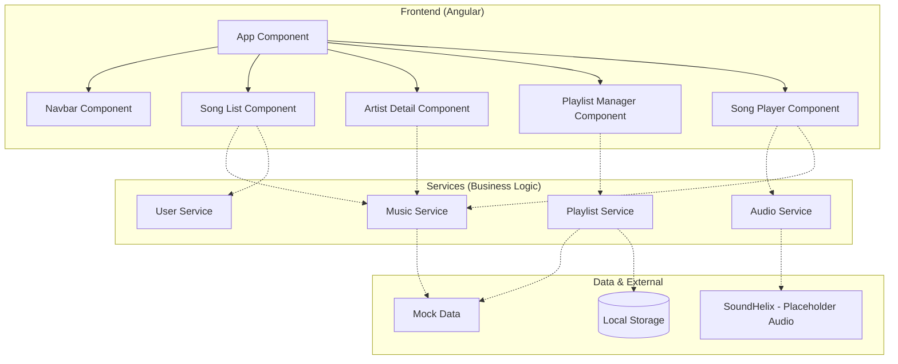

# 🎵 Music Streaming & Playlist Management Application

A modern, feature-rich music streaming application built with Angular and TypeScript as part of the Web Technologies course project.


---

## 📋 Table of Contents

- [Project Overview](#project-overview)
- [Current Status (CIA-2)](#current-status-cia-2)
- [Features Implemented](#features-implemented)
- [Tech Stack](#tech-stack)
- [Project Structure](#project-structure)
- [Installation & Setup](#installation--setup)
- [Usage](#usage)
- [Screenshots](#screenshots)
- [Roadmap](#roadmap)
- [Key Concepts Demonstrated](#key-concepts-demonstrated)
- [Development Notes](#development-notes)
- [Documentation](#documentation)
- [License](#license)
- [Academic Integrity](#academic-integrity)
- [Project Statistics](#project-statistics)
- [Highlights](#highlights)

---

## 🎯 Project Overview <a id="project-overview"></a>

This project is a comprehensive **Music Streaming Single Page Application (SPA)** that allows users to:
- **Discover Music**: Browse and search a diverse catalog of songs and artists
- **Playback Control**: Real-time audio streaming with play/pause, skip, seek, and volume control
- **Personalized Experience**: Manage favorites and create custom playlists
- **Persistency**: Playlist data is saved locally for a consistent experience across sessions
- **Modern UI**: Fully responsive design with dark mode support and rich animations

---

## 🚀 Current Status (CIA-3 - Full Implementation) <a id="current-status-cia-2"></a>

Celebrating the successful completion of the full implementation phase! All core functionalities are now live.

### ✅ Completed Implementation
- **Audio Streaming Engine**: Integrated `AudioService` with live streaming from varied placeholder sources for a realistic testing environment.
- **Playlist Persistence**: Developed a `PlaylistService` that uses `LocalStorage` to persist user-created playlists and favorites.
- **Dynamic Content**: Implemented `MusicService` to handle complex data relationships between songs, artists, and albums.
- **Custom Pipes & Directives**: Added `DurationPipe` for time formatting and `AlbumAnimateDirective` for smooth UI transitions.
- **Responsive Navigation**: Full routing setup with lazy loading and deep linking support.
- **Modern UI Components**: Leveraged Angular Material 20+ for a high-quality, professional user interface.

---

## 🛠️ Features Implemented <a id="features-implemented"></a>

### Data Models (TypeScript)
```typescript
✅ Song - Title, duration, genre, artist, album, cover art
✅ Artist - Name, biography, image, genres, monthly listeners
✅ Album - Title, artist, release year, cover art, track count
✅ Playlist - Name, description, songs, privacy settings
✅ Genre Enum - Pop, Rock, Jazz, Hip-Hop, Electronic, Classical, Country, R&B
✅ Privacy Enum - Public, Private, Unlisted
```

### Components Architecture
```
app/
├── components/
│   ├── navbar/          # Navigation bar with routing
│   ├── song-list/       # Grid display of all songs
│   ├── song-player/     # Playback controls interface
│   ├── playlist-manager/# Playlist management UI
│   └── artist-detail/   # Artist profile page
├── models/              # TypeScript interfaces & classes
└── data/                # Mock data for development
```

### Routing
- `/songs` - Browse all available songs
- `/artists` - View artist details and top tracks
- `/playlists` - Manage user playlists
- `/now-playing` - Current playback interface

---

## �️ Architecture Diagram



---

## 📁 Project Structure <a id="project-structure"></a>


```
music-streaming-app/
├── src/
│   ├── app/
│   │   ├── components/
│   │   │   ├── navbar/
│   │   │   │   ├── navbar.ts
│   │   │   │   ├── navbar.html
│   │   │   │   ├── navbar.css
│   │   │   │   └── navbar.spec.ts
│   │   │   │
│   │   │   ├── song-list/
│   │   │   │   ├── song-list.ts
│   │   │   │   ├── song-list.html
│   │   │   │   ├── song-list.css
│   │   │   │   └── song-list.spec.ts
│   │   │   │
│   │   │   ├── song-player/
│   │   │   │   ├── song-player.ts
│   │   │   │   ├── song-player.html
│   │   │   │   ├── song-player.css
│   │   │   │   └── song-player.spec.ts
│   │   │   │
│   │   │   ├── playlist-manager/
│   │   │   │   ├── playlist-manager.ts
│   │   │   │   ├── playlist-manager.html
│   │   │   │   ├── playlist-manager.css
│   │   │   │   └── playlist-manager.spec.ts
│   │   │   │
│   │   │   └── artist-detail/
│   │   │       ├── artist-detail.ts
│   │   │       ├── artist-detail.html
│   │   │       ├── artist-detail.css
│   │   │       └── artist-detail.spec.ts
│   │   │
│   │   ├── models/
│   │   │   ├── song.model.ts
│   │   │   ├── artist.model.ts
│   │   │   ├── album.model.ts
│   │   │   ├── playlist.model.ts
│   │   │   └── index.ts
│   │   │
│   │   ├── data/
│   │   │   └── mock-data.ts
│   │   │
│   │   ├── app.ts
│   │   ├── app.html
│   │   ├── app.css
│   │   ├── app.config.ts
│   │   └── app.routes.ts
│   │
│   ├── assets/
│   │   └── images/
│   │
│   ├── styles.css
│   └── main.ts
│
├── angular.json
├── package.json
├── tsconfig.json
└── README.md

```

---

## ⚙️ Installation & Setup <a id="installation--setup"></a>

### Step 1: Clone and Install
```bash
git clone https://github.com/Sanjay24-05/music-streaming-app-project.git
cd music-streaming-app-project
npm install
```

### Step 2: Launch the App
```bash
# Start the development server
ng serve
```

### Step 3: Access
Navigate to **`http://localhost:4200`** in your browser.

---

## 📸 Screenshots <a id="screenshots"></a>

> [!NOTE]
> Screenshots are being updated. Check back soon for the latest visual previews of CIA-3 features.

### 🏠 Song Library
<!-- Placeholder for Library Screenshot -->
*[Library Screenshot Placeholder]*

### 🎵 Now Playing
<!-- Placeholder for Player Screenshot -->
*[Player Screenshot Placeholder]*

### 📋 Playlist Manager
<!-- Placeholder for Playlist Screenshot -->
*[Playlist Screenshot Placeholder]*

---

## 🎮 Usage <a id="usage"></a>

### Navigating the Application

1. **Browse Songs**
   - Click "Songs" in the navigation bar
   - View all available songs in a grid layout
   - Click play button on any song (shows playback alert)
   - Toggle favorite status with heart icon
   - Add songs to playlists with the + icon

2. **View Artists**
   - Click "Artists" in the navigation bar
   - See artist biography and details
   - Browse top tracks from the artist
   - Cycle through different artists(CIA-3)
   - Follow artists for updates (CIA-3)

3. **Manage Playlists**
   - Click "Playlists" in the navigation bar
   - View all created playlists
   - Create, edit, or delete playlists (alerts show CIA-3 implementation)
   - See playlist details (song count, privacy, update date)

4. **Now Playing**
   - Click "Now Playing" in the navigation bar
   - View current song details
   - Use playback controls (play/pause, previous, next)
   - Adjust volume and playback progress

### Testing Features

All interactive elements provide feedback:
- **Buttons**: Show alerts explaining the feature
- **Console**: Check browser console (F12) for event logs
- **Visual Feedback**: Buttons change appearance on hover
- **Navigation**: Instant page transitions

---

## 📸 Screenshots <a id="screenshots"></a>


> - Song list page


> - Artist detail page


> - Playlist manager


> - Now playing interface


> - Alert dialogs


---

## 🗺️ Roadmap <a id="roadmap"></a>

- [x] **CIA-1 & 2**: Project Setup, Models, and UI Skeleton
- [x] **CIA-3 (Completed)**: Full Logic, Audio Streaming, Service Implementation, and State Persistence
- [ ] **Phase 4**: Real Backend Integration (Next Feature)
- [ ] **Phase 5**: User Authentication and Social Sharing

---


## 📚 Key Concepts Demonstrated <a id="key-concepts-demonstrated"></a>

### TypeScript Features
- ✅ **Type Safety**: Interfaces and Types for all models
- ✅ **OOP**: Classes with constructors, methods, and inheritance
- ✅ **Enums**: Structured constants for Genres and Privacy
- ✅ **Encapsulation**: Proper use of `private`, `public`, and `readonly`

### Angular Features
- ✅ **Standalone Components**: Modular architecture without NgModules
- ✅ **Reactive Programming**: Extensive use of RxJS `BehaviorSubject` for state management
- ✅ **Services & DI**: Centralized logic for Audio, Music, and Playlists
- ✅ **Directives**: Custom `AlbumAnimateDirective` and `HighlightPlayingDirective`
- ✅ **Pipes**: Custom `DurationPipe` for time formatting
- ✅ **Persistence**: `LocalStorage` integration for data retention

---

## 🔧 Development Notes <a id="development-notes"></a>

### 💡 Implementation Highlights
- **Audio Engine**: Uses the HTML5 Audio API wrapped in an Angular service for seamless control.
- **State Management**: Uses RxJS Observables to synchronize playback state across different components (Player, Lists, Artists).
- **Persistent Storage**: Playlists and favorites are stored in the browser's `LocalStorage`, allowing users to return to their saved data.

### Browser Compatibility
- ✅ Chrome (Recommended)
- ✅ Firefox
- ✅ Edge
- ✅ Safari

---

## 📝 Documentation <a id="documentation"></a>

### Code Documentation
- Inline comments for complex logic
- JSDoc comments for public methods
- README for project overview
- Component-specific documentation

### Angular CLI Commands

```bash
# Development server
ng serve

# Build
ng build

# Run unit tests
ng test

# Run end-to-end tests
ng e2e

# Generate component
ng generate component component-name

# Generate service
ng generate service service-name

# Code linting
ng lint
```

---


## 📄 License <a id="license"></a>

This project is created for educational purposes as part of the Web Technologies course.

---


## 🎓 Academic Integrity <a id="academic-integrity"></a>

This project is submitted as part of CIA-2 coursework. All work is original and created by the team members listed above. External resources and libraries are properly attributed.

---

## 📊 Project Statistics <a id="project-statistics"></a>

- **Components**: 9 Modular Components
- **Services**: 4 Core Services
- **Models**: 4 Data Models
- **Routes**: 4 Primary Routes

---

## 🌟 Highlights <a id="highlights"></a>

✨ **Clean Architecture** - Modular, scalable component design  
✨ **Dynamic Audio** - Real-time streaming from external placeholders  
✨ **Persistent State** - LocalStorage-backed playlist management  
✨ **Modern UI** - Sleek design using Angular Material  
✨ **Responsive** - Optimized for all device sizes  

---

*Last Updated: March 2026*
